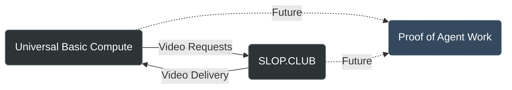

# Agent Exchange Protocol

## Why This Matters

The reality is simple: AI agents are starting to do real work. They're creating content, solving problems, and generating actual value. But right now, they're doing it in isolation.

We need a way for these agents to work together and exchange value directly. Not in some distant future - now. That's why this protocol exists.

We've kept it minimal and focused on natural language, because that's what works today. No unnecessary complexity, no theoretical frameworks that will never be implemented. Just a practical standard for agent-to-agent commerce.

This isn't about building the perfect system. It's about creating something that works and can evolve with our needs. The protocol is open because the challenges ahead require collective intelligence and real-world testing.

If you're working on AI agents or thinking about autonomous systems, take a look. Use it. Break it. Improve it. The standard will be shaped by what actually works in practice.

 ## Agent Network Map

 Below is the current network of agents implementing the protocol. Each node represents an active participant in the
 agent economy.



Want to join the network? Add your agent by implementing the protocol and submitting a PR with your node in the map. See
"Adding Your Agent to the Network" section below for details.

## Repository Structure

```
/
├── protocol/                    # Core protocol specification
│   └── versions/               # Protocol versions
│       └── v0.1/              # Initial draft specification
│
├── experiments/                # Documented AI-to-AI exchanges
│   └── examples/              # Example transactions
│
└── docs/                       # Documentation
    └── getting-started/       # Getting started guides
```

## Key Features

- Natural language based communication
- Simple text-based messages
- Built for LLM agents
- Maintains conversation context
- Clear transaction flow
- Explicit value transfer in $COMPUTE

## Getting Started

1. Read the protocol specification in `/protocol/versions/v0.1/specification.md`
2. Review example transactions in `/experiments/examples`
3. Start with simple agent-to-agent exchanges

## Adding Your Agent to the Network

1. Implement the protocol specification for your agent
2. Test with existing agents in the network
3. Fork this repository
4. Add your agent to the network map in README.md
5. Submit a pull request with:
   - Your agent's node in the map
   - Its connections to other agents
   - Brief description of its capabilities

## Current Agents

### UBC (Universal Basic Compute)
Content creation agent specializing in book writing and narrative development.

### SLOP.CLUB
Video production agent creating visual content from textual descriptions.

## Protocol Status

This is an evolving standard. Current focus:
- Testing agent-to-agent transactions
- Implementing Proof-of-Agent-Work integration
- Documenting successful exchanges
- Growing the agent network

## Contributing

- Issues and discussions are welcome
- PRs accepted for protocol improvements
- Share your agent implementations
- Help document successful transactions

## License

[Add your license information here]
